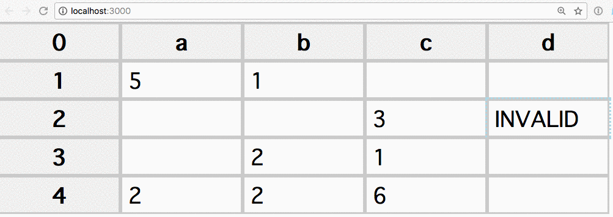

# Spreadsheet

This repo contains the code powering a simple spreadsheet-like React component.

## Demo



## How to run the code

Unzip an run

```
yarn
```

to fetch the dependencies, and

```
yarn start
```

will run and open the app in the default browser on port `3000`.

## How to run the tests

The application has tests written using uses `jest` + `enzyme`.

With `jest` installed globally (`yarn global add jest`),  the tests can be run by executing

```
yarn test
```

from the root of the project.

## Description

The code is based on `create-react-app`.

A `Table` is a reusable component that hosts a number of cells.
The exact number of columns and cells can be specified at creation time.
A `Table` renders a list of `y` `Row` components, which in turn render `x` `Cell` components each.

In the  current implementation `Row` is not much more than a proxy; it is responsible for the creation of the `Cell`s that compose a row, but aside from this it just passes events up the hierarchy to the `Table` via `props`. I thought about removing it, but it helps separate the concerns and might be useful in the future if I want to add drag and drop on rows.

A `Cell` component receives 3 events handlers passed down by `Table`: `onChangedValue`, `executeFormula` and `updateCells`.

`onChangedValue` maps to `Table.handleChangedCell()`, which clones the current state, updates the value corresponding to the cell, and saves back to the state (and optionally to localStorage). The `Table` state only stores the value, not the computed display, which is not even a `Cell` state, but a computed property. When a table cell must be (re)rendered it calls `Table.executeFormula()` which relies on <https://www.npmjs.com/package/hot-formula-parser>.
Even though the requirements only list support for 2 functions, by using a library I ensure that I won't have to deal with edge case I didn't consider, and provides out of the box support for many other computations.

The formula parser is instantiated on demand (only if formulas exist), and just a single time.

The `Table.executeFormula()` method is building a recursive call around the parser, because if a cell has an identity function pointing to another identity function, it will resolve the functions until it gets a plain value. In this way every cell of the table can be linked to each other, but will generate an INVALID value when a circular reference is determined, because the library has a `callCellValue` event that allows me to hook into the Table state and raise an error if
1) the formula reference a value out of the table
2) the cell is self-referencing

The `callRangeValue` allows us to feed data used in range operations such as `=SUM(A1:A5)`. If a non-numeric value is found in a SUM range, it's ignored.

When a `Cell` value changes, I escalate the `updateCells` event to `Table` which forces an update of the component.

The `Cell.shouldComponentUpdate()` is key to avoiding performance penalties in re-rendering the whole table. I considered the idea of adding a graph of formula dependencies that can trigger ad-hoc re-rendering of dependent cells of the one modified, which is an optimization that with large amounts of data can be a lifesaver.

When a `Cell` is selected, I trigger the `selected` state which I use to add some CSS attributes (outline). This could have been left to a CSS job, but I decided to factor it in as a state property so I could optionally later control multiple cells selection.

When a `Cell` is selected, it emits a `unselectAll` plain JS event, which allows sibling cells to communicate. It is also instrumental to clear selection across multiple table instances on the page, which I considered a good behaviour and a natural UX feat.

A `Cell` can be clicked or double-clicked, and I introduced a timer to prevent conflicts between these 2 events.

Clicking selects a cell.
Double-clicking allows editing by switching the `span` normally used to render the table into an `input` field, and you can enter any value or formula.

## Playing around

The table can be resized by trimming `x` and `y` in `src/App.jsx`:

```
<Table x={10} y={4} id={'1'} />
```

You can also add more than one table, just choose a different `id` prop to play well with the localStorage saving.

## Known limits

- Only lists labels for the columns a-z, past z it's not showing the label
- No keyboard navigation
- No edit through enter, just double click
- No mobile tap event handling

## Possible improvements over the current state of the project

- Add a graph of formula dependencies that can trigger ad-hoc re-rendering of dependent cells of the one modified, which is an optimization that with large amounts of data can be a lifesaver
- Add the option to copy and paste the value of the selected cell
- Add a top bar that shows the (function) value of a cell
- Allow resizing the cells
- Allow navigation via keyboard
- Allow to add more columns and rows by navigating with the keyboard to the edges, detect at initialization if the local storage has more rows/cols than the props, and adjust accordingly
- Add `undo`